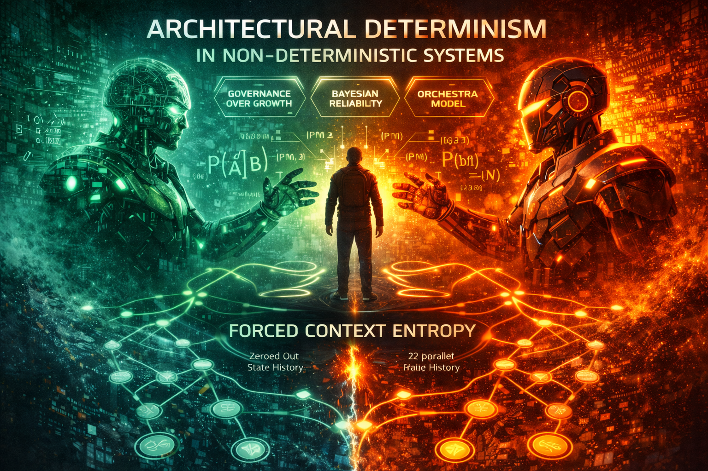



# Technical Philosophy: Architectural Determinism in Non-Deterministic Systems

## Overview
My engineering approach is rooted in the belief that while AI models are inherently probabilistic and "fuzzy," the systems that manage them must be absolute and deterministic. I build the hard shells that allow soft intelligence to function within safe, industrial parameters.

---

## The Methodology: Forced Context Entropy (FCE)

### The Problem: Attention Gravity
Extended AI dialogues suffer from attention gravity, where the model becomes biased toward its own previous outputs, leading to decay in creative variance and factual rigor.

### The Solution: Forced Context Entropy
I orchestrate parallel, independent model instances with zeroed state history. Each research branch begins from a clean probabilistic baseline, forcing a fresh inference roll.

This ensures the final synthesis is not a continuation of a single narrative thread, but the result of cross-agent convergence.

### The Outcome
This transforms the AI from a chatbot into a synthetic expert panel, reducing hallucination risk and increasing discovery reliability.

---

## Design Principles

### 1. Governance Over Growth
I do not chase the largest model. I chase the most controllable architecture.
My work focuses on local LLM orchestration to maintain data sovereignty and ensure intelligence remains an asset, not a liability.

### 2. Bayesian Reliability
In the Praxis Engine, confidence is treated as a measurable variable.
Bayesian updates are applied to agent performance, allowing systems to detect probable failure and trigger deterministic circuit breakers before cascade.

### 3. The Orchestra Model
LLMs are treated as specialized processors.
The engineer acts as a conductor, using manifest-driven control planes to route tasks to the model best suited to the problem’s frequency domain.

---

This philosophy underpins the RRR_DUAL_CYCLE architecture and associated control systems.
